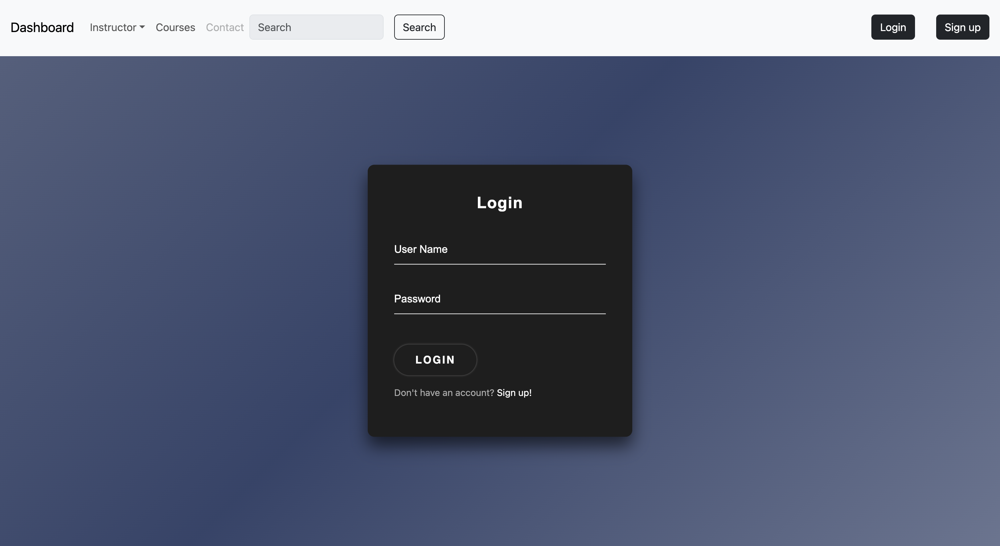
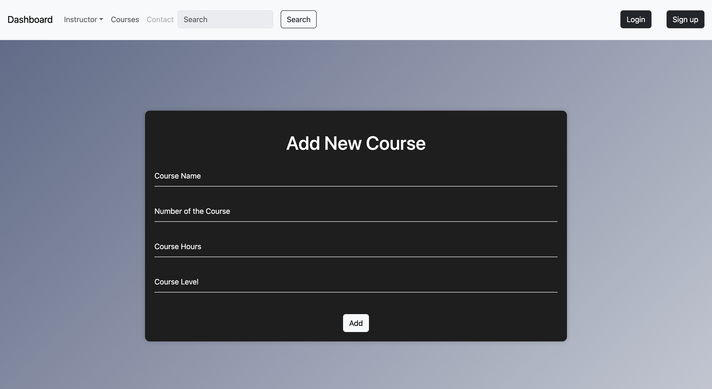
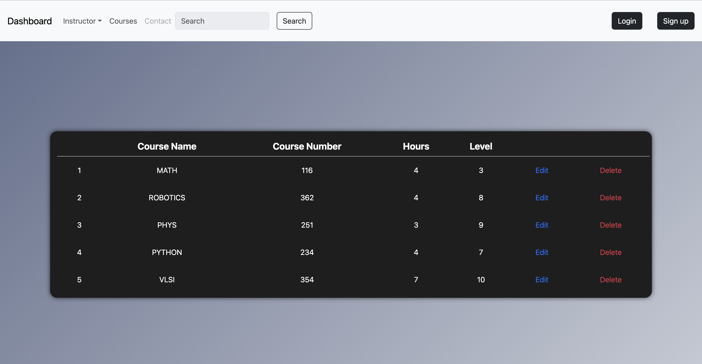
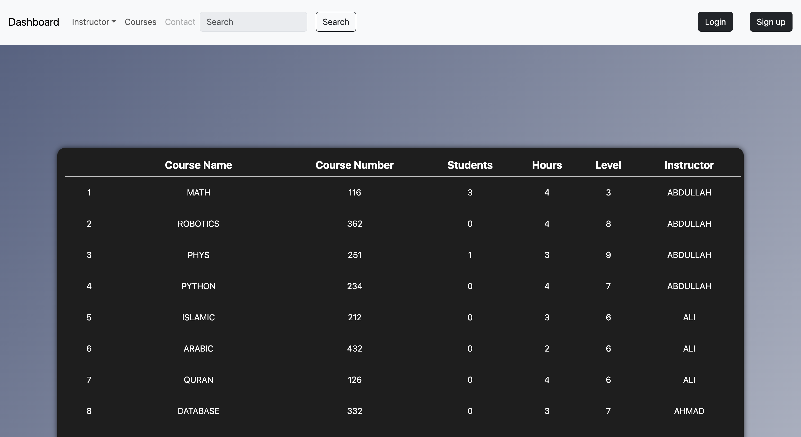

<h1>Instructor Dashboard</h1>

This is a learning management system called "Instructor Dashboard" built using Node.js, Express.js, Bootstrap, and MongoDB. It provides an intuitive web interface for instructors to manage courses, register new users, and view relevant course information. This README file provides an overview of the project and instructions for setting it up.

<h2>Table of Contents</h2>

<ul>
  <li><a href="#features">Features</a></li>
  <li><a href="#prerequisites">Dependencies</a></li>
  <li><a href="#installation">Installation</a></li>
 
</ul>

<h2>Features</h2>

<ol>
  <li>User Registration and Login:
    <ul>
      <li>Instructors can register and create an account using the provided registration page.</li>
      <li>Users can log in securely to access their account and manage their courses.</li>
    </ul>
 
  </li>
   
     
  <li>Add Course Form:
    <ul>
      <li>Instructors can use the add course form page to create and add new courses to the system.</li>
      <li>Each course can include details such as a title, description, duration, and other relevant information.</li>
    </ul>
  </li>
     

  <li>Instructor Courses Page:
    <ul>
      <li>Instructors can view a dedicated page that displays all the courses associated with their account.</li>
      <li>This page provides an overview of each course, including its title, description, and duration.</li>
      <li> and the instructor can edit his courses from this table
    </ul>
  </li>
    
  <li>All Courses Page:
    <ul>
      <li>Instructors and Principal can access a page that shows all the courses created by all instructors in the system.</li>
      <li>This page allows for browsing and searching courses based on their titles, descriptions, or other attributes.</li>
    </ul>
  </li>
      

</ol>

<h2>Dependencies</h2>

Before setting up the Instructor Dashboard project, ensure you have the following prerequisites:

<ul>
  <li>Node.js (version 12 or higher)</li>
  <li>MongoDB (running instance or connection string)</li>
  <li>NPM (Node Package Manager)</li>
</ul>
<h2>Practices</h2>

This project follows the Model-View-Controller (MVC) architectural pattern, utilizes middleware, and employs environment variables (.env) for configuration.

